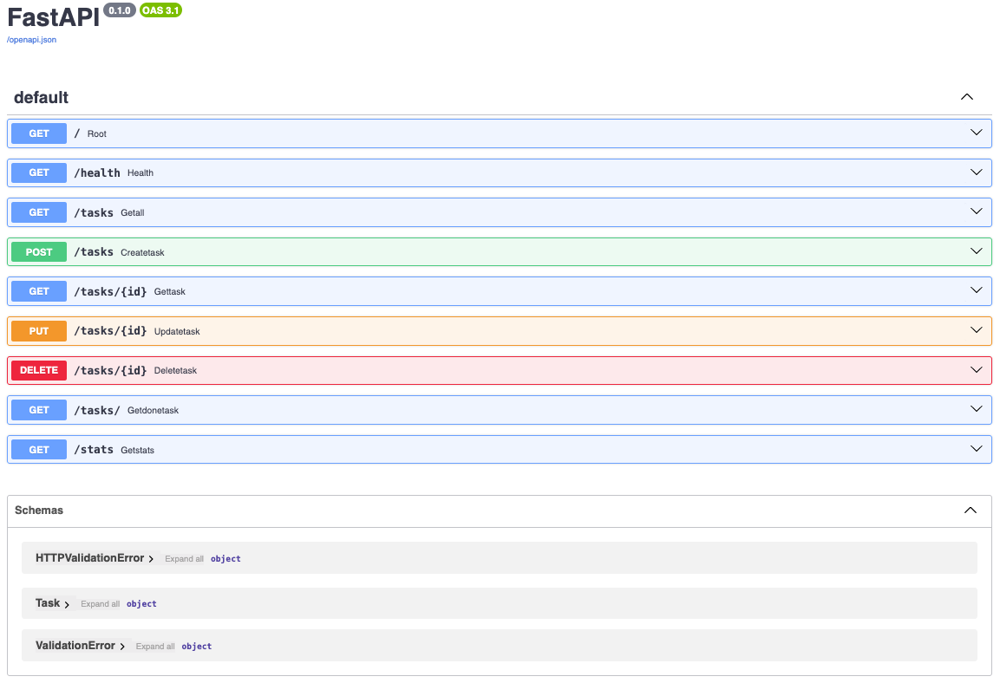

# FLYRANK: CRUD API

A simple CRUD API that manages a to-do list. It demonstrates the four fundamental Create, Read, Update, and Delete (CRUD) operations using FastAPI. The project is handwritten from scratch, includes interactive API documentation through Swagger UI, and maintains a transparent Git commit history.

## Tools

* Python >= 3.11
* FastAPI
* Swagger UI (built in)

## Limitations

* Uses an in-memory database (data is lost when the server stops).
* No authentication or authorization.
* No persistent database integration.

## Getting Started

### Prerequisites

* Python 3.11 or later
* `uv` package manager

### Installation

Clone the repository:

```bash
git clone <repository-url>
cd <repository-folder>
```

Install the project dependencies:

```bash
uv sync
```

### Running the API

Start the development server:

```bash
uv run uvicorn main:app --reload
```

The API will be available at:

* API: http://127.0.0.1:8000
* Swagger UI: http://127.0.0.1:8000/docs
* ReDoc: http://127.0.0.1:8000/redoc

## API Endpoints

| Method | Endpoint      | Description                   |
| ------ | ------------- | ----------------------------- |
| GET    | `/`           | Home                          |
| GET    | `/health`     | Check API status.             |
| GET    | `/tasks`      | Retrieve all tasks            |
| GET    | `/tasks/{id}` | Retrieve a task by ID         |
| GET    | `/tasks/`     | Retrieve all tasks by done    |
| GET    | `/stats`      | Retrieve tasks stats by done  |
| POST   | `/tasks`      | Create a new task             |
| PUT    | `/tasks/{id}` | Update an existing task       |
| DELETE | `/tasks/{id}` | Delete a task                 |

## Example Request

Create a new task:

curl -i -X POST http://localhost:8000/tasks -H "Content-Type: application/json" -d '{"title":"Buy milk"}'

HTTP/1.1 201 Created
date: Fri, 31 Jul 2026 15:32:36 GMT
server: uvicorn
content-length: 40
content-type: application/json

{"id":4,"title":"Buy milk","done":false}%  

## Swagger UI




## AI vs Me

1. What did the AI do better?

Used id-based lookup instead of list-index math, so deletes never corrupted later lookups — a bug my version had from the start (tasks[id - 1]).
Added a global exception handler converting FastAPI's default 422s into the 400s the spec actually asked for; I only caught blank titles manually, not missing/malformed fields. Yes, I understand it — it's just a try/except-style hook that rewrites any validation error's status/body before it reaches the client.

2. What did it get wrong or quietly ignore?

Renamed my GET /tasks/ filter to /tasks/filter/{done} without flagging it as a deviation from what I'd specified.
Made PUT take a full JSON body instead of the query-param partial update I'd written, and never called out that swap as a decision.

3. What did my prompt forget to specify — and what got silently decided?

Never defined PUT's body shape or full-replace vs. partial-update semantics — the AI picked full JSON replace on its own.
Never said what a zero-result filter or empty stats should return — it silently chose 200 with an empty list, where my code defaulted to 404.

## Project Structure

```text
.
├── main.py
├── pyproject.toml
├── README.md
└── .gitignore
└── images/
    └──swagger_overview.png
```

## Notes

This project is intended as a simple demonstration of RESTful CRUD operations using FastAPI. Since it uses an in-memory data store, all tasks are reset whenever the application restarts.