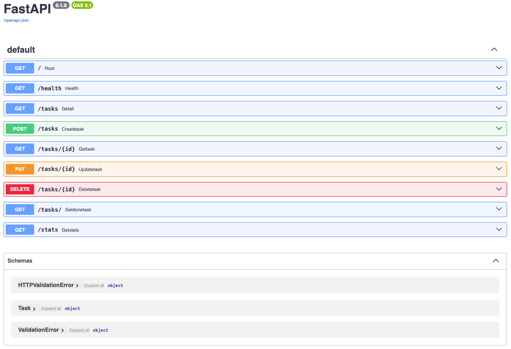
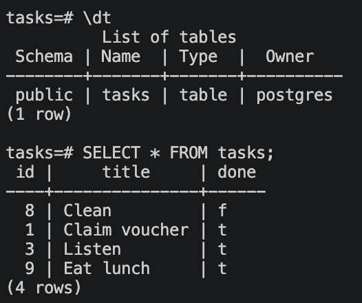

# FLYRANK: CRUD API

A REST API for managing a to-do list, built with FastAPI. The project started as an in-memory CRUD implementation and progressively introduced SQLite, PostgreSQL, Docker, environment-based configuration, and a layered architecture.

## Tech Stack

* Python 3.11
* FastAPI
* Psycopg
* PostgreSQL
* Docker
* uv

## Current Features

* CRUD operations for tasks
* Task filtering and statistics
* PostgreSQL persistence
* Dockerized API and database
* Environment-based database configuration
* Interactive API documentation with Swagger UI
* Repository and service layers

## Progression

1. **In-memory CRUD API**
2. **SQLite persistence**
3. **PostgreSQL with Docker**
4. **Gradual architectural refactoring**

## Getting Started

### Prerequisites

* Docker

### Setup

Clone the repository:

```bash
git clone https://github.com/Limkurt/flyrank-backend-assignment.git
cd flyrank-backend-assignment
```

Create `.env` from `.env.example` and configure the database variables.

Start the application:

```bash
docker compose up
```

Docker Compose builds the API image, installs the Python dependencies, and starts the PostgreSQL database.

The API will be available at:

* http://0.0.0.0:8000
* Swagger UI: http://0.0.0.0:8000/docs

## API Endpoints

| Method | Endpoint      | Description              |
| ------ | ------------- | ------------------------ |
| GET    | `/`           | Home                     |
| GET    | `/health`     | API health check         |
| GET    | `/tasks`      | Retrieve all tasks       |
| GET    | `/tasks/{id}` | Retrieve a task          |
| GET    | `/tasks/`     | Retrieve tasks by status |
| GET    | `/stats`      | Task statistics          |
| POST   | `/tasks`      | Create a task            |
| PUT    | `/tasks/{id}` | Update a task            |
| DELETE | `/tasks/{id}` | Delete a task            |

## Example

```bash
curl -X POST http://0.0.0.0:8000/tasks \
  -H "Content-Type: application/json" \
  -d '{"title":"Buy milk"}'
```

```json
{
  "id": 4,
  "title": "Buy milk",
  "done": false
}
```

## Swagger UI



## Database



## AI vs Me

### 1. What did the AI do better?

Used schemas and OOP principles, which ensured consistency between request and response payloads. It also generated better Swagger documentation by organizing endpoints and providing example request bodies. Its `try/finally` dependency pattern managed database session lifecycles more cleanly than my initial use of `contextlib.closing`.

Overall, the AI-generated implementation was cleaner, although it did not abstract `HTTPException` into a reusable helper function, which would have been useful for reducing repetition when writing the code manually.

### 2. What did it get wrong or quietly ignore?

It ignored the requested database filename, `tasks.db`, and defaulted to `app.db`.

### 3. What did my prompt forget to specify?

I did not define custom error-handling scenarios or HTTP status codes, so the generated implementation defaulted to `HTTP_404_NOT_FOUND`.

## Limitations

* No authentication or authorization yet.
* Project architecture is still being refined.
